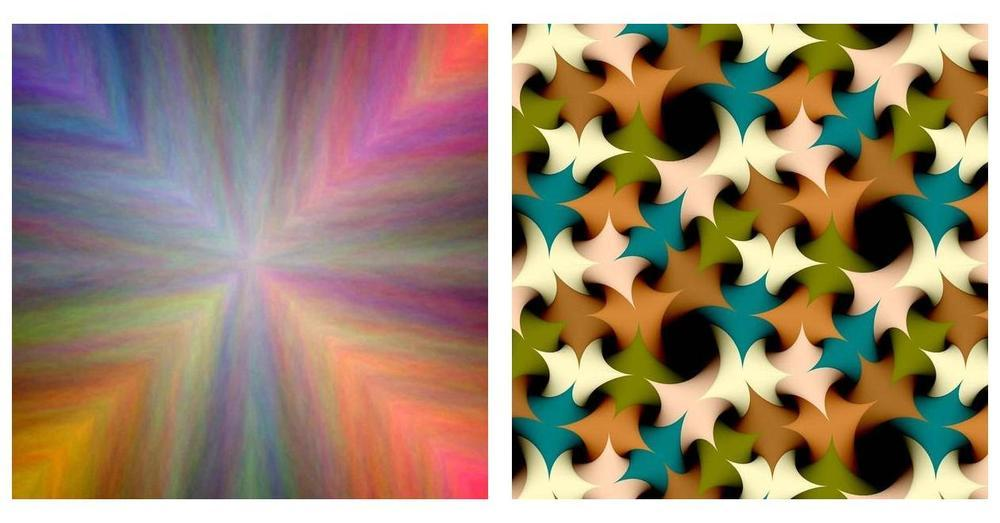
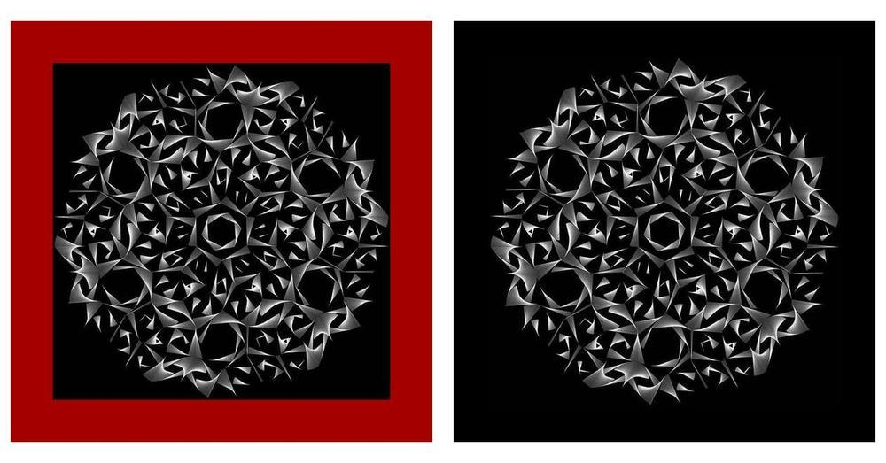
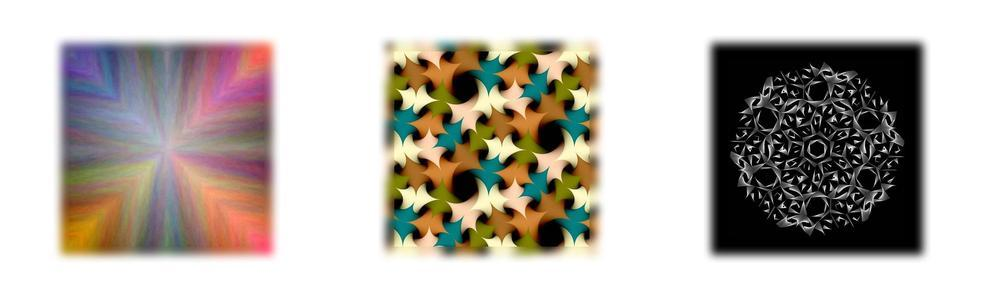
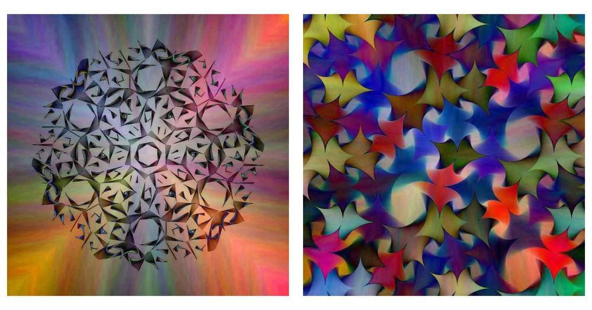
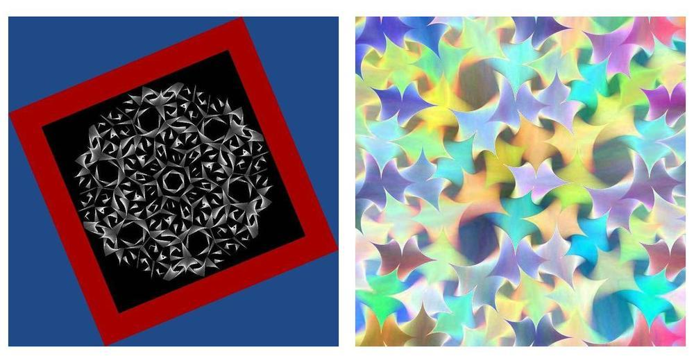
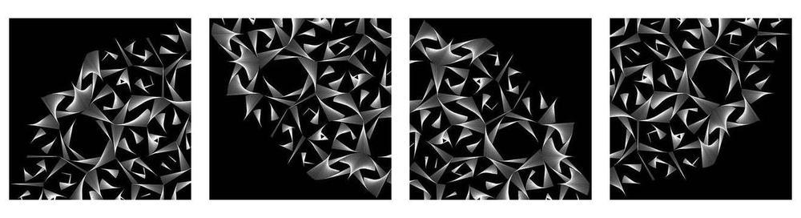
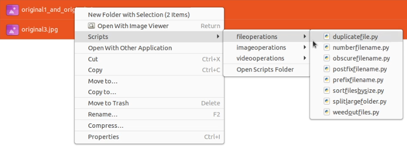
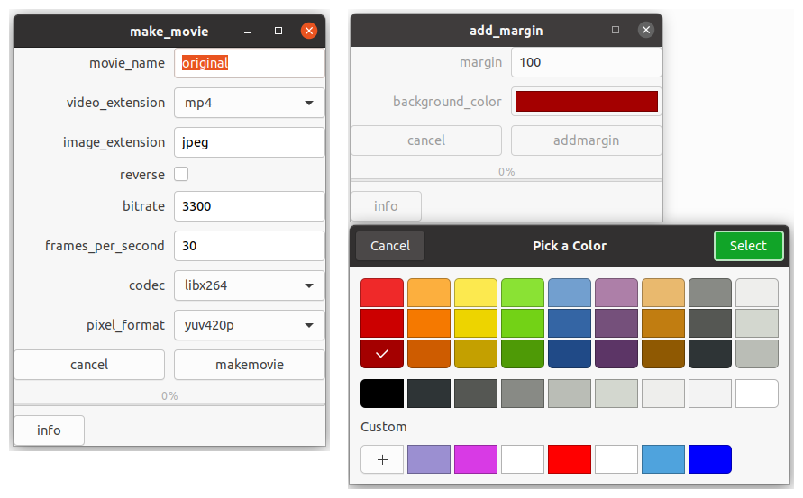

======================================================
File operations in Python, with a focus on image files
======================================================
This is a collection of file operations in Python.
The image operations depend on Pillow, the movie operations on ffmpeg.
For adding image tags, piexif should be installed.
Some methods might be useful in your project, just copy and paste them.

All of these methods can be plugged in easily to the Nautilus file system (GNOME Files), using 'python_nautilus'
(Then you can select the file(s) or a directory, and apply a method on all files with a mouse click).
See the section about Nautilus below.

All the methods are listed with an explanation under 'list of methods'.

============
Installation
============

.. code-block:: bash

    $ git clone https://github.com/josvromans/python_file_operations.git
    $ cd python_file_operations/
    $ virtualenv --python=/usr/bin/python3 env
    $ . env/bin/activate
    $ pip install -r requirements.txt

===============
List of methods
===============
Here is a list of all the methods (and more will be added in the near future)

File operations
---------------
- prefix_filename
- postfix_filename
- split_large_folder (for example in subdirectories of 100 files)
- weed_out_files (keep only 1 out of x files)
- make_filename_unrecognizable (convert filenames to an unreadable hash string)
- number_filenames (define start value and step)
- sort_files_by_size
- duplicate_file

Image operations
----------------
- resize_image
- add_margin
- crop_image_in_equal_parts
- paste_image_in_center
- crop_center
- apply_filter (BLUR, FIND_EDGES, CONTOUR, DETAIL, EDGE_ENHANCE, EMBOSS, SHARPEN, SMOOTH, random)
- image_difference
- save_image_tags
- put_images_on_wall
- blur_edges
- rotate_image
- grayscale
- color_grayscale
- solarize

video operations
----------------
- make movie (from a directory of image files)
- make_slideshow (from a directory of image files, output a movie file)
- merge videos (take two or more video files, and past them to one final video file)

==============
Image examples
==============

Example image 1 and 2. They are put next to each other in one image file with :code:`put_images_on_wall`

Original image 3a and 3b: the :code:`add_margin` method was applied with a red background (left, image 3a) and with a black background (right, image 3b)

:code:`put_images_on_wall` with the 3 example images, and selected 'Blur' for the frame. The :code:`blur_edges` method will apply this effect on a single image.

Left: :code:`image_difference` applied to image 1 and 3. Right: :code:`image_difference` applied image 1 and 2.

Left: :code:`rotate_image` image 3a on a blue background. Right: :code:`solarize` applied to the diff image above.

:code:`crop_image_in_equal_parts` used with parameters :code:`x=2 and y=2` resulting in 4 image parts with equal dimensions.

==================================================
Run any of these methods in Nautilus / GNOME Files
==================================================
All the methods in this projects can be easily hooked into Nautilus. This makes it super easy to apply any of the actions
to manually selected files, or an entire directory.
An easy way to do this is by placing the Python file from the 'nautilus_python' project in the Nautilus scripts directory.
This file will render an input window for the user and call the method.
All you have to do then is select which methods you want to make available, add an executable with a name you like, that links to the correct method.

This is described in this project:
https://github.com/josvromans/nautilus_python
You could consider to put all the code from this project in the Nautilus scripts folder,
and then you don't have to do play with sys.path (which you have to do if you put your code elsewhere)

When all methods are added (and using subdirectories to separate the actions), it will look like this:

As you can see, the methods appear in the menu with the filename you chose, but without the underscores.

This is how the user input windows are rendered. Booleans will become checkboxes, colors get a color picker, and fields that are defined with a limited set of choices will get a multiple choice combo box.

A lot of room for improvement, but the nice thing is that you can use this while developing!
So you can try any of PIL features (filters, ImageOps, etc) and apply them while browsing through images in the file system.

I might write a decent Nautilus scripts plugin later.
For now it is a bunch of methods that does the job for me!

====
TODO
====
Add descriptions for the methods

Write a Nautilus script, where all these methods are available in a user friendly way.

Add more methods that I stashed

write unit tests

=======================
Artworks made in Python
=======================
In case you like the artworks in this README, you can have a look at more of it at

https://www.josvromans.com

and

https://www.instagram.com/jos.vromans (where most content is shared)

Every single image on any of these places is generated in Python.
In the process of creating and organizing my artworks, I wrote some of the methods that are now in this project.

The Nautilus approach is the easiest way I could come up with, to apply certain actions (self written code) to (image) files in the filesystem (without typing file paths).
